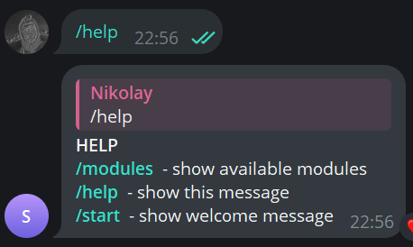
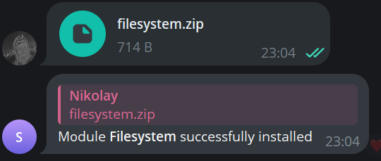
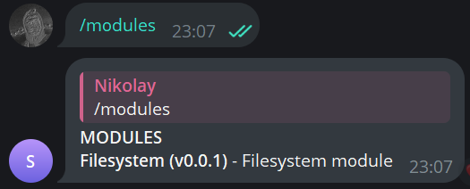
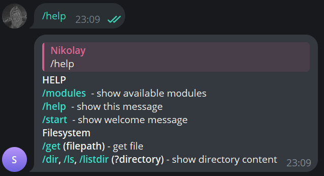
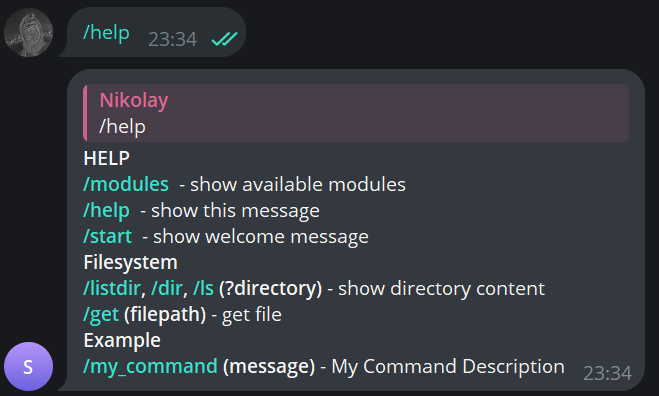

# TRAT

<p align="center">
  
</p>

<p align="center">
    <a href="https://github.com/CrazyProger1/TRAT/blob/master/LICENSE"></a>
    <a href="https://github.com/CrazyProger1/TRAT/releases/latest"></a>
</p>

<p align="center">
    <a href="#"></a>
    <a href="https://github.com/psf/black"></a>
</p>


TRAT is a powerful cross-platform RAT based on Telegram-bot protocol.

## Key-Features

- Cross-platform
- Modularity allowing endless functionality expansion
- Based on Telegram-bot protocol

## Disclaimer

This program is provided for educational and research purposes only. The creator of this program does not condone or
support any illegal or malicious activity, and will not be held responsible for any such actions taken by others who may
use this program. By downloading or using this program, you acknowledge that you are solely responsible for any
consequences that may result from the use of this program.

## Usage

To use the program create and fulfill ```.env``` file:

```dotenv
TOKEN="Your Bot Token"
ADMIN="Your Telegram Chat ID"
```

Ensure you have [Python](https://www.python.org/)^3.12(recommended) & [requirements](requirements.txt) installed.

After that you can run it:

```shell
python -m trat
```

or [build.](#building)

If everything is ok, you will receive a message from the bot:


Send ```/help``` to obtain to get help:



By default, you don't have any modules, but you can install one by sending zipped module to bot:



You can check it by ```/modules``` command:



Now all new commands appear in the ```/help``` menu:



## Building

Ensure you have [pyinstaller](https://pyinstaller.org/) installed.

To build, just run the script:

```shell
sh ./scripts/build.sh
```

or (for Windows):

```commandline
"scripts/build.bat"
```

## Development

### Module

Example [module.py](examples/example/module.py):

```python
__name__ = "Example"  # module name
__author__ = "crazyproger1"  # module author
__version__ = "0.0.1"  # module version
__doc__ = "Example module description"  # module description

import aiogram
from aiogram import types

from trat.api import AdminFilter, CommandFilter

router = aiogram.Router()  # default aiogram router

routers = [  # !important, must be in all user-modules
    router,
]


@router.message(  # default aiogram message handler
    AdminFilter(),  # only you can use this command (chatid specified in .env)
    CommandFilter(  # custom command filter
        "my_command",
        description="My Command Description",  # command description, for a help menu
        tag=__name__,  # tag, for a help menu
        arguments=("message",),  # arguments of command, for a help menu
    )
)
async def on_my_command(message: types.Message):
    print(message.text)
```

Your command in the help menu:



## Status

```V0.0.1``` - **RELEASED**

**Working on new modules!**

**Coming soon:**

- [ ] Filesystem (extended)
- [ ] Encryption (files)
- [ ] Camera (photo, video)
- [ ] Screen (screenshots, video)
- [ ] System (execute commands, restart, shutdown)
- [ ] Info (PC info)
- [ ] Stealer (browser passwords)

## License

TRAT is released under the MIT License. See the bundled [LICENSE](LICENSE) file for details.